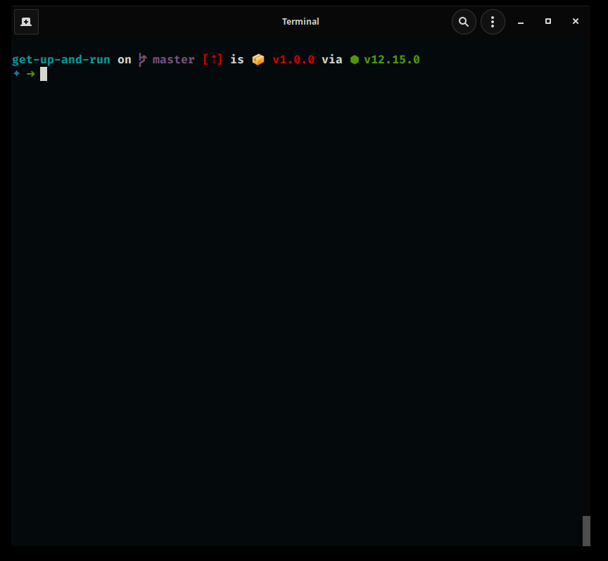

# 🏃 Get up and Run!

Automate your setup for different work environments/projects - run tedious commands faster, by defining frequently used commands under `get_up_and_run.json` file anywhere in their filesystem. Then running those commands using the `run <commandsuite>` command



## 📦 Install

```
npm install -g get-up-and-run
yarn add global get-up-and-run
```

## ⌨️ Usage

`run <commandsuite>`


## 👨‍💻 Contributing

Feel free to create issues and/or send a pull request to this repository with your code contributions
